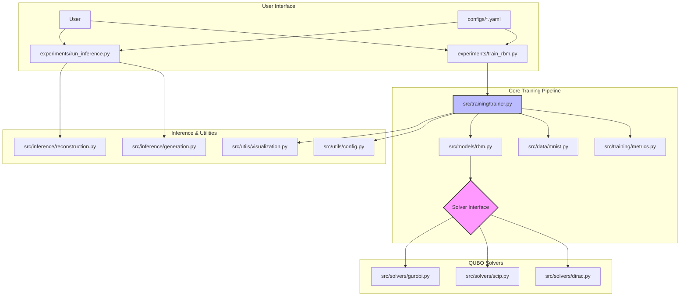

# Design Document: RBM with Perturb-and-MAP Training

**Version:** 1.0  
**Date:** 2024-06-23  
**Authors:** RBM Research Team

## Table of Contents

1. [Architecture Overview](#1-architecture-overview)
2. [Module Descriptions](#2-module-descriptions)
3. [Key Algorithms](#3-key-algorithms)
4. [Usage Tutorial](#4-usage-tutorial)
5. [Configuration Reference](#5-configuration-reference)
6. [Extension Points](#6-extension-points)
7. [Technical Implementation](#7-technical-implementation)
8. [Testing Strategy](#8-testing-strategy)
9. [Troubleshooting](#9-troubleshooting)

---

## 1. Architecture Overview

The system is designed as a modular framework for training and evaluating Restricted Boltzmann Machines (RBMs) using the Perturb-and-MAP (P&M) methodology. The architecture emphasizes clear separation of concerns between model definition, QUBO optimization, training orchestration, and data handling.

### Core Workflow

The framework follows a configuration-driven approach where users define experiments in YAML files, executed through CLI entry points:

1. **Configuration Loading**: YAML files define experimental parameters
2. **Data Preparation**: MNIST dataset loading with filtering and preprocessing  
3. **Model Initialization**: RBM model creation based on configuration
4. **Solver Selection**: QUBO solver instantiation (Gurobi, SCIP, or Dirac-3)
5. **Training Loop**: P&M methodology with QUBO formulation and solving
6. **Checkpointing**: Model state persistence and metric logging
7. **Inference**: Reconstruction and generation using trained models

### High-Level Component Diagram



### Project Structure

```
RBM/
├── src/rbm/                    # Main package
│   ├── models/                 # Neural network models
│   │   ├── rbm.py             # Core RBM with P&M
│   │   └── hybrid.py          # CNN-RBM hybrid
│   ├── solvers/               # QUBO optimization backends
│   │   ├── base.py            # Abstract solver interface
│   │   ├── gurobi.py          # Gurobi commercial solver
│   │   ├── scip.py            # SCIP open-source solver
│   │   └── dirac.py           # Dirac-3 quantum simulator
│   ├── training/              # Training orchestration
│   │   ├── trainer.py         # Main training controller
│   │   └── metrics.py         # Evaluation metrics
│   ├── inference/             # Model inference capabilities
│   │   ├── reconstruction.py  # Image reconstruction
│   │   └── generation.py      # Sample generation
│   ├── data/                  # Data handling utilities
│   │   └── mnist.py           # MNIST dataset processing
│   └── utils/                 # Supporting utilities
│       ├── config.py          # YAML configuration management
│       └── visualization.py   # Plotting and visualization
├── experiments/               # CLI entry points
│   ├── train_rbm.py          # Training script
│   └── run_inference.py      # Inference script
├── configs/                   # Experiment configurations
│   ├── default.yaml          # Default parameters
│   ├── mnist_digit6.yaml     # MNIST digit 6 experiment
│   └── test_quick.yaml       # Fast testing configuration
├── tests/                     # Test suite
├── notebooks/                 # Jupyter demonstration notebooks
└── pyproject.toml            # Package configuration
```

---

## 2. Module Descriptions

### 2.1 Core Models (`src/rbm/models/`)

#### `rbm.py` - Core RBM Implementation

The heart of the system, implementing the Restricted Boltzmann Machine with P&M training capabilities.

**Key Components:**
- **Parameters**: Weight matrix `W` (n_hidden × n_visible), visible bias `b`, hidden bias `c`
- **QUBO Generation**: Methods `create_joint_qubo()` and `create_qubo_for_sampling()`
- **Energy Functions**: Free energy computation and reconstruction methods

```python
class RBM(nn.Module):
    def __init__(self, n_visible: int, n_hidden: int):
        super(RBM, self).__init__()
        self.n_visible = n_visible
        self.n_hidden = n_hidden
        self.W = nn.Parameter(torch.randn(n_hidden, n_visible) * 0.01)
        self.c = nn.Parameter(torch.zeros(n_hidden))
        self.b = nn.Parameter(torch.zeros(n_visible))
```

**Key Methods:**
- `create_joint_qubo()`: Generates QUBO matrix for joint (v,h) sampling
- `create_qubo_for_sampling(v)`: Creates conditional QUBO for hidden units given visible
- `reconstruct(h)`: Reconstructs visible units from hidden representation

#### `hybrid.py` - CNN-RBM Hybrid Model

Extends the basic RBM with convolutional preprocessing, demonstrating model extensibility.

### 2.2 QUBO Solvers (`src/rbm/solvers/`)

The solver subsystem implements the **Strategy Pattern** for pluggable optimization backends.

#### `base.py` - Abstract Solver Interface

```python
class QUBOSolver(ABC):
    @abstractmethod
    def solve(self, Q: Union[np.ndarray, torch.Tensor]) -> np.ndarray:
        """Solve QUBO problem: min x^T Q x where x ∈ {0,1}^n"""
        pass
```

#### `gurobi.py` - Commercial Optimization

High-performance commercial solver with extensive configuration options.

```python
class GurobiSolver(QUBOSolver):
    def solve(self, Q: Union[np.ndarray, torch.Tensor]) -> np.ndarray:
        # Convert to Gurobi model and solve
        model = gp.Model()
        # ... solver-specific implementation
        return solution_array
```

#### `scip.py` - Open Source Alternative

SCIP-based solver providing free alternative to commercial options.

#### `dirac.py` - Quantum Annealing Simulation

Simulates quantum annealing approaches using Dirac-3 simulator.

### 2.3 Training System (`src/rbm/training/`)

#### `trainer.py` - Training Orchestration

The `Trainer` class coordinates the entire training process:

**Core Responsibilities:**
- Data iteration and batch processing
- P&M negative phase via QUBO solving
- Contrastive Divergence weight updates
- Metric computation and logging
- Checkpoint management

```python
class Trainer:
    def __init__(self, model, solver, optimizer, config):
        self.model = model
        self.solver = solver
        self.optimizer = optimizer
        self.config = config
    
    def train_epoch(self, data_loader):
        for batch_idx, (data, _) in enumerate(data_loader):
            # Positive phase
            v_pos = data
            
            # Negative phase via P&M + QUBO
            Q_joint = self.model.create_joint_qubo()
            vh_sample = self.solver.solve(Q_joint)
            v_neg = vh_sample[:self.model.n_visible]
            
            # Contrastive divergence update
            self._update_weights(v_pos, v_neg)
```

#### `metrics.py` - Evaluation Metrics

Implements evaluation metrics specific to generative models:
- Reconstruction error
- Free energy estimation
- Training convergence indicators

### 2.4 Inference Capabilities (`src/rbm/inference/`)

#### `reconstruction.py` - Image Reconstruction

Provides various reconstruction methods:
- Single-pass reconstruction
- Batch reconstruction
- Iterative denoising
- Reconstruction error computation

```python
def reconstruct_image(model: RBM, image_tensor: torch.Tensor, solver: QUBOSolver) -> torch.Tensor:
    """Perform single-pass reconstruction using P&M sampling"""
    v_input = (image_tensor.view(-1) > 0.5).float()
    Q_h, _ = model.create_qubo_for_sampling(v_input)
    h_sample = torch.from_numpy(solver.solve(Q_h)).float()
    return model.reconstruct(h_sample)
```

#### `generation.py` - Sample Generation

Multiple generation strategies:
- Gibbs sampling chains
- Joint P&M sampling
- Conditional generation
- Likelihood estimation

### 2.5 Data Handling (`src/rbm/data/`)

#### `mnist.py` - MNIST Dataset Utilities

Specialized MNIST handling with:
- Automatic downloading
- Digit filtering (e.g., only digit 6)
- Image downsampling (28×28 → 11×11)
- Noise injection for denoising experiments

```python
def load_mnist_data(config: dict, train: bool = True) -> Tuple[DataLoader, int]:
    """Load MNIST with filtering and preprocessing"""
    # Download and load dataset
    dataset = MNIST(root=config['data']['data_root'], train=train, download=True)
    
    # Apply digit filtering
    if config['data'].get('digit_filter') is not None:
        digit = config['data']['digit_filter']
        mask = (dataset.targets == digit)
        dataset.data = dataset.data[mask]
        dataset.targets = dataset.targets[mask]
    
    # Apply transformations and create DataLoader
    return DataLoader(dataset, batch_size=config['training']['batch_size'])
```

### 2.6 Utilities (`src/rbm/utils/`)

#### `config.py` - Configuration Management

YAML-based configuration system with validation:

```python
class ConfigManager:
    def load(self, config_name: str) -> dict:
        """Load configuration by name from configs/ directory"""
        config_path = f"configs/{config_name}.yaml"
        with open(config_path, 'r') as f:
            return yaml.safe_load(f)
```

#### `visualization.py` - Plotting and Visualization

Comprehensive plotting utilities:
- Training curve visualization
- Reconstruction comparison plots
- Generated sample grids
- Weight matrix visualization

---

## 3. Key Algorithms

### 3.1 Perturb-and-MAP (P&M) Methodology

The Perturb-and-MAP approach replaces traditional Gibbs sampling with optimization-based sampling using the Gumbel trick.

#### Traditional RBM Training Challenge

Standard RBM training via Contrastive Divergence requires sampling from the model distribution:

```
P(v) ∝ Σ_h exp(-E(v,h))
```

Where the energy function is:
```
E(v,h) = -v^T W h - b^T v - c^T h
```

Gibbs sampling can be slow to converge, especially with strong correlations.

#### P&M Solution

The Gumbel trick shows that sampling from `P(x) ∝ exp(E(x))` is equivalent to:

```
x* = argmax_x (E(x) + g_x)
```

where `g_x` are i.i.d. Gumbel random variables.

#### Implementation Steps

1. **Perturbation**: Add Gumbel noise to bias terms
   ```python
   gumbel_v = torch.distributions.Gumbel(0, 1).sample((n_visible,))
   gumbel_h = torch.distributions.Gumbel(0, 1).sample((n_hidden,))
   
   b_perturbed = self.b + gumbel_v
   c_perturbed = self.c + gumbel_h
   ```

2. **QUBO Formulation**: Convert perturbed energy minimization to QUBO
3. **Optimization**: Solve using specialized QUBO solvers
4. **Sample Extraction**: Use optimized state as negative sample

### 3.2 QUBO Formulation

The core algorithmic contribution is converting the perturbed RBM energy minimization into a Quadratic Unconstrained Binary Optimization problem.

#### Energy Function Analysis

Starting with the perturbed energy:
```
E_perturbed(v,h) = -v^T W h - b_perturbed^T v - c_perturbed^T h
```

#### Hidden Unit Optimization

For binary hidden units, we can analytically optimize them out:
```
h_j* = 1 if (W_j^T v + c_perturbed_j) > 0, else 0
```

This allows reformulation as optimization over visible units only.

#### QUBO Matrix Construction

The resulting optimization problem takes the form:
```
min_v v^T Q v + linear_term^T v
```

The `create_joint_qubo()` method in `rbm.py` implements this transformation:

```python
def create_joint_qubo(self) -> torch.Tensor:
    """Create QUBO matrix for joint (v,h) sampling"""
    n_total = self.n_visible + self.n_hidden
    Q = torch.zeros(n_total, n_total)
    
    # Add interaction terms
    Q[:self.n_visible, self.n_visible:] = -self.W.t()
    Q[self.n_visible:, :self.n_visible] = -self.W
    
    # Add bias terms with Gumbel perturbation
    gumbel_v = torch.distributions.Gumbel(0, 1).sample((self.n_visible,))
    gumbel_h = torch.distributions.Gumbel(0, 1).sample((self.n_hidden,))
    
    Q.diagonal()[:self.n_visible] = -(self.b + gumbel_v)
    Q.diagonal()[self.n_visible:] = -(self.c + gumbel_h)
    
    return Q
```

### 3.3 Training Algorithm

The complete P&M training algorithm:

```python
def train_epoch(self, data_loader):
    for batch_idx, (data, _) in enumerate(data_loader):
        # 1. Positive phase (data statistics)
        v_pos = (data.view(data.size(0), -1) > 0.5).float()
        h_pos_prob = torch.sigmoid(torch.matmul(v_pos, self.model.W.t()) + self.model.c)
        
        # 2. Negative phase via P&M
        batch_size = v_pos.size(0)
        v_neg_samples = []
        
        for i in range(batch_size):
            # Generate QUBO for this sample
            Q_joint = self.model.create_joint_qubo()
            
            # Solve QUBO
            solution = self.solver.solve(Q_joint)
            
            # Extract visible part as negative sample
            v_neg = solution[:self.model.n_visible]
            v_neg_samples.append(torch.from_numpy(v_neg))
        
        v_neg = torch.stack(v_neg_samples).float()
        h_neg_prob = torch.sigmoid(torch.matmul(v_neg, self.model.W.t()) + self.model.c)
        
        # 3. Contrastive divergence update
        self.optimizer.zero_grad()
        
        # Compute gradients
        dW = torch.matmul(h_pos_prob.t(), v_pos) - torch.matmul(h_neg_prob.t(), v_neg)
        dc = torch.mean(h_pos_prob - h_neg_prob, dim=0)
        db = torch.mean(v_pos - v_neg, dim=0)
        
        # Apply gradients
        self.model.W.grad = -dW / batch_size
        self.model.c.grad = -dc
        self.model.b.grad = -db
        
        self.optimizer.step()
```

---

## 4. Usage Tutorial

### 4.1 Installation

#### Prerequisites
- Python 3.10 or higher
- `uv` package manager

#### Step 1: Environment Setup

```bash
# Clone the repository
git clone <repository_url>
cd RBM

# Create virtual environment using uv
uv venv
source .venv/bin/activate  # On Windows: .venv\Scripts\activate
```

#### Step 2: Package Installation

```bash
# Install core package
uv pip install -e .

# Install solver dependencies (choose based on availability)
# For Gurobi (requires license)
uv pip install gurobipy

# For SCIP (open source)
uv pip install pyscipopt

# For development tools
uv add --dev pytest black isort mypy
```

#### Step 3: Verify Installation

```bash
# Test package structure
python -c "import rbm; print('RBM package installed successfully')"

# Run package validation
python test_package.py
```

### 4.2 Basic Training

#### Quick Start with Default Configuration

```bash
# Train RBM on MNIST digit 6
train-rbm --config mnist_digit6 --epochs 10

# Alternative: direct script execution
python experiments/train_rbm.py --config mnist_digit6 --epochs 10
```

#### Training Output

The training script provides real-time feedback:

```
=== RBM Training ===
Configuration: mnist_digit6
Model: RBM (121 visible, 64 hidden)
Solver: Gurobi
Dataset: MNIST digit 6 (5918 samples)
------------------------------

Epoch 1/10:
  Batch 1/11: Loss = 0.4523, Reconstruction Error = 0.2834
  Batch 2/11: Loss = 0.4401, Reconstruction Error = 0.2756
  ...
  Epoch Loss: 0.4234, Reconstruction Error: 0.2654
  Checkpoint saved: pm_rbm_digit6_checkpoint.pth

Epoch 2/10:
  ...
```

#### Monitoring Training

Training artifacts are saved in the configured output directory:
- `*.log`: Detailed training logs
- `*_checkpoint.pth`: Model checkpoints
- `figures/`: Training curves and sample visualizations

### 4.3 Custom Configuration

#### Creating Custom Experiments

1. **Copy base configuration:**
   ```bash
   cp configs/mnist_digit6.yaml configs/my_experiment.yaml
   ```

2. **Edit configuration parameters:**
   ```yaml
   # configs/my_experiment.yaml
   model:
     n_visible: 121
     n_hidden: 128    # Increased hidden units
     model_type: rbm

   training:
     epochs: 50       # More training epochs
     learning_rate: 0.001  # Lower learning rate
     batch_size: 4
     batch_limit: 20

   data:
     digit_filter: 7  # Train on digit 7 instead
     image_size: [11, 11]

   solver:
     name: gurobi
     time_limit: 120.0  # Longer optimization time
   ```

3. **Run custom experiment:**
   ```bash
   train-rbm --config my_experiment
   ```

### 4.4 Running Inference

#### Reconstruction Tasks

```bash
# Run reconstruction on trained model
run-inference path/to/checkpoint.pth \
    --config mnist_digit6 \
    --task reconstruction \
    --output-dir results/reconstruction/
```

This generates:
- `reconstruction_clean.png`: Original vs reconstructed images
- `reconstruction_denoising.png`: Denoising results

#### Sample Generation

```bash
# Generate new samples
run-inference path/to/checkpoint.pth \
    --config mnist_digit6 \
    --task generation \
    --output-dir results/generation/
```

Output:
- `generation_gibbs.png`: Samples from Gibbs sampling
- `generation_joint.png`: Samples from joint P&M sampling

#### Combined Inference

```bash
# Run both reconstruction and generation
run-inference path/to/checkpoint.pth \
    --config mnist_digit6 \
    --task both \
    --output-dir results/complete/
```

### 4.5 Advanced Usage

#### Solver Comparison

Compare different QUBO solvers on the same model:

```bash
# Train with Gurobi
train-rbm --config mnist_digit6 --solver gurobi --output-dir results/gurobi/

# Train with SCIP
train-rbm --config mnist_digit6 --solver scip --output-dir results/scip/

# Train with Dirac (if available)
train-rbm --config mnist_digit6 --solver dirac --output-dir results/dirac/
```

#### Hyperparameter Sweeps

```bash
# Different learning rates
for lr in 0.001 0.01 0.1; do
    train-rbm --config mnist_digit6 --learning-rate $lr --output-dir results/lr_$lr/
done

# Different hidden sizes
for hidden in 32 64 128; do
    # Modify config programmatically or create variants
    train-rbm --config mnist_digit6_h$hidden
done
```

#### GPU Training

The framework automatically detects and uses GPU when available:

```python
# Automatic GPU detection in trainer.py
device = torch.device('cuda' if torch.cuda.is_available() else 'cpu')
model = model.to(device)
```

---

## 5. Configuration Reference

### 5.1 Configuration File Structure

All experiments are controlled via YAML configuration files stored in `configs/`. The configuration system supports:

- **Hierarchical Structure**: Nested parameter organization
- **Type Validation**: Automatic type checking and conversion
- **Default Values**: Fallback to sensible defaults
- **Environment Variables**: Override from environment

### 5.2 Complete Configuration Schema

#### Model Configuration

```yaml
model:
  n_visible: 121          # Number of visible units (image pixels)
  n_hidden: 64            # Number of hidden units
  model_type: rbm         # Model type: 'rbm' or 'cnn_rbm'
```

**Constraints:**
- `n_visible` must match image dimensions (11×11 = 121 for downsampled MNIST)
- `n_hidden` affects model capacity and training time
- `model_type` determines which model class to instantiate

#### Training Configuration

```yaml
training:
  epochs: 20              # Number of training epochs
  learning_rate: 0.002    # Optimizer learning rate
  batch_size: 2           # Training batch size
  batch_limit: 11         # Max batches per epoch (for experimentation)
  optimizer: sgd          # Optimizer type: 'sgd', 'adam', 'adamw'
  checkpoint_every: 5     # Save checkpoint every N epochs
  checkpoint_path: model_checkpoint.pth  # Checkpoint filename
```

**Training Notes:**
- Small batch sizes (1-4) are typical due to QUBO solving overhead
- `batch_limit` useful for quick experimentation
- `checkpoint_every` balances storage vs recovery granularity

#### Data Configuration

```yaml
data:
  dataset: mnist          # Dataset type
  digit_filter: 6         # Filter specific digit (0-9) or null for all
  image_size: [11, 11]    # Target image dimensions
  data_root: ./data       # Data storage directory
  train_split: true       # Use training split
  download: true          # Auto-download if missing
```

**Data Processing Pipeline:**
1. Download MNIST to `data_root`
2. Filter by `digit_filter` if specified
3. Downsample to `image_size`
4. Convert to binary (threshold 0.5)
5. Flatten for RBM input

#### Solver Configuration

```yaml
solver:
  name: gurobi           # Solver type: 'gurobi', 'scip', 'dirac'
  time_limit: 60.0       # Max solving time per QUBO (seconds)
  suppress_output: true  # Suppress solver verbose output
```

**Solver-Specific Parameters:**

```yaml
# Gurobi-specific
solver:
  name: gurobi
  time_limit: 60.0
  mip_gap: 0.01         # Optimality gap tolerance
  threads: 4            # Number of solver threads

# SCIP-specific  
solver:
  name: scip
  time_limit: 60.0
  gap_limit: 0.01

# Dirac-specific
solver:
  name: dirac
  num_samples: 10       # Number of annealing samples
  relaxation_schedule: 1 # Annealing schedule
```

#### Inference Configuration

```yaml
inference:
  gibbs_steps: 500           # Gibbs sampling chain length
  num_generated_samples: 10  # Number of samples to generate
  reconstruction_samples: 5   # Number of images to reconstruct
```

#### Logging Configuration

```yaml
logging:
  log_file: training.log     # Log filename
  save_plots: true           # Save training plots
  plot_every: 5              # Plot frequency (epochs)
  figures_dir: ./figures     # Plot output directory
```

### 5.3 Example Configurations

#### Fast Testing Configuration (`configs/test_quick.yaml`)

```yaml
model:
  n_visible: 121
  n_hidden: 16        # Small for speed
  model_type: rbm

training:
  epochs: 1
  learning_rate: 0.01
  batch_size: 1
  batch_limit: 1      # Single batch only
  optimizer: sgd
  checkpoint_every: 1
  checkpoint_path: test_checkpoint.pth

data:
  dataset: mnist
  digit_filter: 6
  image_size: [11, 11]
  data_root: ./data
  train_split: true
  download: true

solver:
  name: gurobi
  time_limit: 5.0     # Short time limit
  suppress_output: true

inference:
  gibbs_steps: 10     # Short chains
  num_generated_samples: 2
  reconstruction_samples: 2

logging:
  log_file: test_training.log
  save_plots: true
  plot_every: 1
  figures_dir: ./test_results/figures
```

#### Production Configuration (`configs/mnist_digit6.yaml`)

```yaml
model:
  n_visible: 121
  n_hidden: 64
  model_type: rbm

training:
  epochs: 20
  learning_rate: 0.002
  batch_size: 2
  batch_limit: 11
  optimizer: sgd
  checkpoint_every: 5
  checkpoint_path: pm_rbm_digit6_checkpoint.pth

data:
  dataset: mnist
  digit_filter: 6
  image_size: [11, 11]
  data_root: ./data
  train_split: true
  download: true

solver:
  name: gurobi
  time_limit: 60.0
  suppress_output: true

inference:
  gibbs_steps: 500
  num_generated_samples: 10
  reconstruction_samples: 5

logging:
  log_file: training_digit6.log
  save_plots: true
  plot_every: 5
  figures_dir: ./figures
```

### 5.4 Configuration Validation

The system performs automatic validation:

```python
# src/rbm/utils/config.py
def validate_config(config: dict) -> dict:
    """Validate and normalize configuration"""
    
    # Check required sections
    required_sections = ['model', 'training', 'data', 'solver']
    for section in required_sections:
        if section not in config:
            raise ValueError(f"Missing required section: {section}")
    
    # Validate model parameters
    assert config['model']['n_visible'] > 0
    assert config['model']['n_hidden'] > 0
    
    # Validate image dimensions
    image_size = config['data']['image_size']
    expected_visible = image_size[0] * image_size[1]
    if config['model']['n_visible'] != expected_visible:
        raise ValueError(f"Model n_visible ({config['model']['n_visible']}) "
                        f"doesn't match image size {image_size} "
                        f"(expected {expected_visible})")
    
    return config
```

---

## 6. Extension Points

The framework is designed for extensibility. This section provides detailed guidance for common extensions.

### 6.1 Adding New QUBO Solvers

#### Step 1: Implement Solver Interface

Create a new solver class in `src/rbm/solvers/`:

```python
# src/rbm/solvers/my_solver.py
import numpy as np
from typing import Union
import torch
from .base import QUBOSolver

class MySolver(QUBOSolver):
    """Custom QUBO solver implementation"""
    
    def __init__(self, time_limit: float = 60.0, **kwargs):
        self.time_limit = time_limit
        # Initialize solver-specific parameters
        
    @property
    def name(self) -> str:
        return "MySolver"
    
    @property
    def is_available(self) -> bool:
        """Check if solver dependencies are available"""
        try:
            import my_solver_library
            return True
        except ImportError:
            return False
    
    def solve(self, Q: Union[np.ndarray, torch.Tensor]) -> np.ndarray:
        """
        Solve QUBO problem: min x^T Q x where x ∈ {0,1}^n
        
        Args:
            Q: QUBO matrix (n×n)
            
        Returns:
            Binary solution vector (n,)
        """
        # Convert input to numpy if needed
        if isinstance(Q, torch.Tensor):
            Q_np = Q.detach().cpu().numpy()
        else:
            Q_np = Q
            
        # Solver-specific implementation
        import my_solver_library
        
        # Create solver instance
        solver = my_solver_library.Solver()
        solver.set_time_limit(self.time_limit)
        
        # Add variables (binary)
        n = Q_np.shape[0]
        variables = [solver.add_binary_var(f"x_{i}") for i in range(n)]
        
        # Add objective (quadratic terms)
        objective = 0
        for i in range(n):
            for j in range(n):
                if Q_np[i, j] != 0:
                    objective += Q_np[i, j] * variables[i] * variables[j]
        
        solver.minimize(objective)
        
        # Solve
        status = solver.solve()
        
        if not status.is_optimal():
            print(f"Warning: Solver did not find optimal solution: {status}")
        
        # Extract solution
        solution = np.array([var.value for var in variables])
        return solution.astype(np.float32)
```

#### Step 2: Register Solver

Update the solver factory in `src/rbm/training/trainer.py`:

```python
def create_solver(config: dict) -> QUBOSolver:
    """Create QUBO solver based on configuration"""
    solver_config = config['solver']
    solver_name = solver_config['name']
    
    if solver_name == 'gurobi':
        from ..solvers.gurobi import GurobiSolver
        return GurobiSolver(**solver_config)
    elif solver_name == 'scip':
        from ..solvers.scip import ScipSolver
        return ScipSolver(**solver_config)
    elif solver_name == 'my_solver':
        from ..solvers.my_solver import MySolver
        return MySolver(**solver_config)
    else:
        raise ValueError(f"Unknown solver: {solver_name}")
```

#### Step 3: Add Configuration Support

Update configuration validation to recognize the new solver:

```python
# src/rbm/utils/config.py
VALID_SOLVERS = ['gurobi', 'scip', 'dirac', 'my_solver']

def validate_config(config: dict) -> dict:
    solver_name = config['solver']['name']
    if solver_name not in VALID_SOLVERS:
        raise ValueError(f"Unknown solver: {solver_name}. Valid options: {VALID_SOLVERS}")
```

#### Step 4: Test Integration

```python
# Test configuration
solver_config = {
    'name': 'my_solver',
    'time_limit': 30.0,
    'custom_param': 'value'
}

# Create test QUBO
Q = np.random.randn(10, 10)
Q = (Q + Q.T) / 2  # Make symmetric

# Test solver
solver = MySolver(**solver_config)
solution = solver.solve(Q)
print(f"Solution: {solution}")
```

### 6.2 Adding New Model Architectures

#### Step 1: Define Model Class

```python
# src/rbm/models/new_model.py
import torch
import torch.nn as nn
import numpy as np
from typing import Tuple, Optional
from .rbm import RBM  # Base class or interface

class ConvolutionalRBM(nn.Module):
    """Convolutional RBM with shared weights"""
    
    def __init__(self, 
                 image_shape: Tuple[int, int],
                 filter_shape: Tuple[int, int],
                 n_filters: int):
        super().__init__()
        self.image_shape = image_shape
        self.filter_shape = filter_shape
        self.n_filters = n_filters
        
        # Convolutional weights
        self.W = nn.Parameter(torch.randn(*filter_shape, n_filters) * 0.01)
        self.c = nn.Parameter(torch.zeros(n_filters))
        self.b = nn.Parameter(torch.zeros(*image_shape))
        
    def create_joint_qubo(self) -> torch.Tensor:
        """Create QUBO matrix for ConvRBM"""
        # Implement QUBO formulation for convolutional structure
        # This requires adapting the energy function to convolutions
        pass
        
    def energy(self, v: torch.Tensor, h: torch.Tensor) -> torch.Tensor:
        """Compute energy for visible and hidden configurations"""
        # Implement convolutional energy function
        pass
```

#### Step 2: Update Model Factory

```python
# src/rbm/training/trainer.py
def create_model(config: dict) -> torch.nn.Module:
    """Create model based on configuration"""
    model_config = config['model']
    model_type = model_config['model_type']
    
    if model_type == 'rbm':
        from ..models.rbm import RBM
        return RBM(
            n_visible=model_config['n_visible'],
            n_hidden=model_config['n_hidden']
        )
    elif model_type == 'conv_rbm':
        from ..models.new_model import ConvolutionalRBM
        return ConvolutionalRBM(
            image_shape=tuple(model_config['image_shape']),
            filter_shape=tuple(model_config['filter_shape']),
            n_filters=model_config['n_filters']
        )
    else:
        raise ValueError(f"Unknown model type: {model_type}")
```

#### Step 3: Configuration Schema

```yaml
# Example configuration for ConvolutionalRBM
model:
  model_type: conv_rbm
  image_shape: [28, 28]
  filter_shape: [5, 5]
  n_filters: 16
```

### 6.3 Adding New Datasets

#### Step 1: Implement Dataset Loader

```python
# src/rbm/data/cifar10.py
import torch
from torch.utils.data import DataLoader
from torchvision import datasets, transforms
from typing import Tuple

def load_cifar10_data(config: dict, train: bool = True) -> Tuple[DataLoader, int]:
    """Load CIFAR-10 dataset with preprocessing"""
    
    # Define preprocessing
    transform_list = [
        transforms.Grayscale(),  # Convert to grayscale
        transforms.Resize(config['data']['image_size']),
        transforms.ToTensor(),
        transforms.Lambda(lambda x: (x > 0.5).float())  # Binarize
    ]
    transform = transforms.Compose(transform_list)
    
    # Load dataset
    dataset = datasets.CIFAR10(
        root=config['data']['data_root'],
        train=train,
        download=config['data'].get('download', True),
        transform=transform
    )
    
    # Apply class filtering if specified
    if config['data'].get('class_filter') is not None:
        target_class = config['data']['class_filter']
        indices = [i for i, (_, label) in enumerate(dataset) if label == target_class]
        dataset = torch.utils.data.Subset(dataset, indices)
        print(f"Filtered CIFAR-10 to class {target_class}: {len(indices)} samples")
    
    # Create DataLoader
    data_loader = DataLoader(
        dataset,
        batch_size=config['training']['batch_size'],
        shuffle=True,
        num_workers=config['data'].get('num_workers', 0)
    )
    
    return data_loader, len(dataset)
```

#### Step 2: Register Dataset

```python
# src/rbm/training/trainer.py
def create_data_loader(config: dict, train: bool = True) -> Tuple[DataLoader, int]:
    """Create data loader based on configuration"""
    dataset_name = config['data']['dataset']
    
    if dataset_name == 'mnist':
        from ..data.mnist import load_mnist_data
        return load_mnist_data(config, train)
    elif dataset_name == 'cifar10':
        from ..data.cifar10 import load_cifar10_data
        return load_cifar10_data(config, train)
    else:
        raise ValueError(f"Unknown dataset: {dataset_name}")
```

#### Step 3: Configuration Support

```yaml
# CIFAR-10 configuration example
data:
  dataset: cifar10
  class_filter: 0        # Filter for specific class (0-9)
  image_size: [16, 16]   # Downsample to 16x16
  data_root: ./data
  download: true
  num_workers: 4

model:
  n_visible: 256  # 16x16 = 256
  n_hidden: 64
  model_type: rbm
```

### 6.4 Custom Inference Methods

#### Adding New Inference Techniques

```python
# src/rbm/inference/custom_inference.py
import torch
import numpy as np
from typing import List
from ..models.rbm import RBM
from ..solvers.base import QUBOSolver

def variational_inference(model: RBM, 
                         data: torch.Tensor,
                         solver: QUBOSolver,
                         num_iterations: int = 100) -> torch.Tensor:
    """Variational inference for posterior estimation"""
    
    # Initialize variational parameters
    q_h = torch.sigmoid(torch.matmul(data, model.W.t()) + model.c)
    
    for iteration in range(num_iterations):
        # Variational updates
        # ... implement variational optimization
        pass
    
    return q_h

def persistent_contrastive_divergence(model: RBM,
                                    solver: QUBOSolver,
                                    data_loader,
                                    num_chains: int = 100) -> List[torch.Tensor]:
    """Persistent CD using P&M for negative phase"""
    
    # Initialize persistent chains
    chains = [torch.rand(model.n_visible) > 0.5 for _ in range(num_chains)]
    
    for batch in data_loader:
        # Update chains using P&M
        for i, chain in enumerate(chains):
            Q_joint = model.create_joint_qubo()
            solution = solver.solve(Q_joint)
            chains[i] = torch.from_numpy(solution[:model.n_visible])
    
    return chains
```

---

## 7. Technical Implementation

### 7.1 Design Patterns

#### Strategy Pattern - QUBO Solvers

The solver subsystem exemplifies the Strategy Pattern, allowing runtime selection of optimization algorithms:

```python
# Abstract strategy
class QUBOSolver(ABC):
    @abstractmethod
    def solve(self, Q: np.ndarray) -> np.ndarray:
        pass

# Concrete strategies
class GurobiSolver(QUBOSolver): ...
class ScipSolver(QUBOSolver): ...
class DiracSolver(QUBOSolver): ...

# Context using strategy
class Trainer:
    def __init__(self, solver: QUBOSolver):
        self.solver = solver
    
    def negative_phase(self, Q):
        return self.solver.solve(Q)  # Polymorphic call
```

**Benefits:**
- Easy addition of new solvers
- Runtime solver switching
- Isolated solver-specific code
- Testability through mock solvers

#### Factory Pattern - Component Creation

Component creation uses Factory Pattern for consistent instantiation:

```python
def create_solver(config: dict) -> QUBOSolver:
    """Factory for QUBO solvers"""
    solver_type = config['solver']['name']
    solver_params = config['solver']
    
    if solver_type == 'gurobi':
        return GurobiSolver(**solver_params)
    elif solver_type == 'scip':
        return ScipSolver(**solver_params)
    # ... etc

def create_model(config: dict) -> nn.Module:
    """Factory for neural network models"""
    # Similar pattern for models
```

#### Configuration Pattern

Centralized configuration management with validation:

```python
class ConfigManager:
    """Centralized configuration management"""
    
    def load(self, config_name: str) -> dict:
        """Load and validate configuration"""
        raw_config = self._load_yaml(config_name)
        validated_config = self._validate(raw_config)
        return self._apply_defaults(validated_config)
```

### 7.2 Error Handling Strategy

#### Graceful Solver Failures

QUBO solving can fail due to time limits or numerical issues:

```python
class QUBOSolver(ABC):
    def solve(self, Q: np.ndarray) -> np.ndarray:
        try:
            return self._solve_impl(Q)
        except SolverTimeoutError:
            logger.warning("Solver timeout, using heuristic solution")
            return self._heuristic_solution(Q)
        except SolverError as e:
            logger.error(f"Solver failed: {e}")
            return self._random_solution(Q.shape[0])
```

#### Configuration Validation

Comprehensive configuration validation prevents runtime errors:

```python
def validate_config(config: dict) -> dict:
    """Validate configuration with detailed error messages"""
    errors = []
    
    # Check solver availability
    solver_name = config['solver']['name']
    solver_class = SOLVER_REGISTRY.get(solver_name)
    if solver_class and not solver_class.is_available:
        errors.append(f"Solver '{solver_name}' is not available. "
                     f"Install required dependencies.")
    
    # Check dimension consistency
    image_size = config['data']['image_size']
    n_visible = config['model']['n_visible']
    expected_visible = image_size[0] * image_size[1]
    if n_visible != expected_visible:
        errors.append(f"Model n_visible ({n_visible}) doesn't match "
                     f"image dimensions {image_size} (expected {expected_visible})")
    
    if errors:
        raise ConfigurationError('\n'.join(errors))
    
    return config
```

### 7.3 Performance Optimization

#### Memory Management

The framework implements several memory optimization strategies:

```python
class Trainer:
    def train_epoch(self, data_loader):
        for batch_idx, (data, _) in enumerate(data_loader):
            # Process one sample at a time to avoid memory explosion
            for sample in data:
                # Generate QUBO matrix
                Q = self.model.create_joint_qubo()
                
                # Solve (potentially GPU-accelerated)
                with torch.cuda.device(self.device):
                    solution = self.solver.solve(Q)
                
                # Immediately clear intermediate results
                del Q
                torch.cuda.empty_cache()  # Clear GPU memory
```

#### Batching Strategy

Due to QUBO solving overhead, the framework uses adaptive batching:

```python
def adaptive_batch_processing(self, data_loader):
    """Process batches with adaptive sizing based on solver performance"""
    
    for batch in data_loader:
        batch_size = len(batch)
        
        # Start timing
        start_time = time.time()
        
        # Process samples individually or in micro-batches
        if batch_size > self.config['training'].get('max_parallel_qubo', 1):
            # Sequential processing for large batches
            results = [self._process_sample(sample) for sample in batch]
        else:
            # Parallel processing for small batches
            results = self._process_batch_parallel(batch)
        
        # Adapt batch size based on timing
        elapsed = time.time() - start_time
        self._update_batch_strategy(elapsed, batch_size)
```

#### GPU Acceleration

While QUBO solving typically occurs on CPU, tensor operations can leverage GPU:

```python
class RBM(nn.Module):
    def create_joint_qubo(self) -> torch.Tensor:
        """Create QUBO matrix with GPU acceleration"""
        device = self.W.device
        
        # All tensor operations on same device
        n_total = self.n_visible + self.n_hidden
        Q = torch.zeros(n_total, n_total, device=device)
        
        # GPU-accelerated tensor operations
        Q[:self.n_visible, self.n_visible:] = -self.W.t()
        Q[self.n_visible:, :self.n_visible] = -self.W
        
        # Move to CPU for QUBO solver (most solvers are CPU-only)
        return Q.cpu()
```

### 7.4 Logging and Monitoring

#### Structured Logging

The framework implements structured logging for analysis:

```python
import logging
import json
from datetime import datetime

class StructuredLogger:
    def __init__(self, log_file: str):
        self.logger = logging.getLogger('rbm_training')
        handler = logging.FileHandler(log_file)
        handler.setFormatter(logging.Formatter('%(message)s'))
        self.logger.addHandler(handler)
        self.logger.setLevel(logging.INFO)
    
    def log_epoch(self, epoch: int, metrics: dict):
        """Log epoch results in structured format"""
        log_entry = {
            'timestamp': datetime.now().isoformat(),
            'event': 'epoch_complete',
            'epoch': epoch,
            'metrics': metrics
        }
        self.logger.info(json.dumps(log_entry))
    
    def log_solver_performance(self, solver_name: str, solve_time: float, 
                              qubo_size: int, optimal: bool):
        """Log QUBO solver performance"""
        log_entry = {
            'timestamp': datetime.now().isoformat(),
            'event': 'qubo_solve',
            'solver': solver_name,
            'solve_time': solve_time,
            'qubo_size': qubo_size,
            'optimal': optimal
        }
        self.logger.info(json.dumps(log_entry))
```

#### Training Metrics

Comprehensive metric tracking for model evaluation:

```python
class TrainingMetrics:
    def __init__(self):
        self.metrics = {
            'epoch_losses': [],
            'reconstruction_errors': [],
            'solver_times': [],
            'convergence_indicators': []
        }
    
    def update(self, epoch: int, loss: float, reconstruction_error: float,
               solver_times: List[float]):
        """Update metrics for current epoch"""
        self.metrics['epoch_losses'].append(loss)
        self.metrics['reconstruction_errors'].append(reconstruction_error)
        self.metrics['solver_times'].extend(solver_times)
        
        # Compute convergence indicators
        if len(self.metrics['epoch_losses']) > 1:
            loss_change = abs(self.metrics['epoch_losses'][-1] - 
                            self.metrics['epoch_losses'][-2])
            self.metrics['convergence_indicators'].append(loss_change)
    
    def plot_training_curves(self, save_path: str):
        """Generate training visualization"""
        import matplotlib.pyplot as plt
        
        fig, axes = plt.subplots(2, 2, figsize=(12, 8))
        
        # Loss curve
        axes[0,0].plot(self.metrics['epoch_losses'])
        axes[0,0].set_title('Training Loss')
        axes[0,0].set_xlabel('Epoch')
        axes[0,0].set_ylabel('Loss')
        
        # Reconstruction error
        axes[0,1].plot(self.metrics['reconstruction_errors'])
        axes[0,1].set_title('Reconstruction Error')
        axes[0,1].set_xlabel('Epoch')
        axes[0,1].set_ylabel('Error')
        
        # Solver timing distribution
        axes[1,0].hist(self.metrics['solver_times'], bins=30)
        axes[1,0].set_title('QUBO Solve Time Distribution')
        axes[1,0].set_xlabel('Time (seconds)')
        axes[1,0].set_ylabel('Frequency')
        
        # Convergence
        if self.metrics['convergence_indicators']:
            axes[1,1].plot(self.metrics['convergence_indicators'])
            axes[1,1].set_title('Convergence Indicator')
            axes[1,1].set_xlabel('Epoch')
            axes[1,1].set_ylabel('Loss Change')
        
        plt.tight_layout()
        plt.savefig(save_path)
        plt.close()
```

---

## 8. Testing Strategy

### 8.1 Testing Philosophy

The testing strategy follows a multi-layered approach:

1. **Unit Tests**: Test individual components in isolation
2. **Integration Tests**: Test component interactions
3. **Regression Tests**: Ensure model performance consistency
4. **End-to-End Tests**: Validate complete workflows

### 8.2 Unit Testing

#### Testing QUBO Solvers

Solver tests use known small problems with analytical solutions:

```python
# tests/test_solvers.py
import pytest
import numpy as np
from rbm.solvers.gurobi import GurobiSolver
from rbm.solvers.scip import ScipSolver

class TestQUBOSolvers:
    """Test suite for QUBO solvers"""
    
    def setup_method(self):
        """Setup test problems with known solutions"""
        # Simple 2x2 QUBO with known minimum
        self.simple_Q = np.array([
            [1, -2],
            [-2, 1]
        ])
        self.simple_solution = np.array([1, 1])  # Known optimal solution
        
        # Larger random QUBO for stress testing
        np.random.seed(42)
        self.random_Q = np.random.randn(10, 10)
        self.random_Q = (self.random_Q + self.random_Q.T) / 2  # Make symmetric
    
    @pytest.mark.skipif(not GurobiSolver.is_available, reason="Gurobi not available")
    def test_gurobi_simple_problem(self):
        """Test Gurobi solver on simple problem"""
        solver = GurobiSolver(suppress_output=True)
        solution = solver.solve(self.simple_Q)
        
        # Check solution is binary
        assert np.all((solution == 0) | (solution == 1))
        
        # Check solution quality (should be optimal for simple problem)
        objective_value = solution.T @ self.simple_Q @ solution
        expected_value = self.simple_solution.T @ self.simple_Q @ self.simple_solution
        assert np.isclose(objective_value, expected_value, rtol=1e-6)
    
    @pytest.mark.skipif(not ScipSolver.is_available, reason="SCIP not available")
    def test_scip_consistency(self):
        """Test SCIP solver consistency"""
        solver = ScipSolver(time_limit=10.0)
        
        # Solve same problem multiple times
        solutions = [solver.solve(self.random_Q) for _ in range(3)]
        
        # All solutions should be binary
        for solution in solutions:
            assert np.all((solution == 0) | (solution == 1))
        
        # Objective values should be consistent (within solver tolerance)
        objectives = [sol.T @ self.random_Q @ sol for sol in solutions]
        assert np.std(objectives) < 1e-3  # Small variance indicates consistency
    
    def test_solver_interface_compliance(self):
        """Test all solvers implement required interface"""
        from rbm.solvers.base import QUBOSolver
        
        available_solvers = []
        if GurobiSolver.is_available:
            available_solvers.append(GurobiSolver())
        if ScipSolver.is_available:
            available_solvers.append(ScipSolver())
        
        for solver in available_solvers:
            # Check inheritance
            assert isinstance(solver, QUBOSolver)
            
            # Check required methods
            assert hasattr(solver, 'solve')
            assert hasattr(solver, 'name')
            assert hasattr(solver, 'is_available')
            
            # Check solve method works
            solution = solver.solve(self.simple_Q)
            assert isinstance(solution, np.ndarray)
            assert solution.shape == (self.simple_Q.shape[0],)
```

#### Testing RBM Model

```python
# tests/test_rbm_model.py
import pytest
import torch
import numpy as np
from rbm.models.rbm import RBM

class TestRBMModel:
    """Test suite for RBM model"""
    
    def setup_method(self):
        """Setup test RBM"""
        self.n_visible = 10
        self.n_hidden = 5
        self.rbm = RBM(self.n_visible, self.n_hidden)
    
    def test_initialization(self):
        """Test RBM parameter initialization"""
        # Check parameter shapes
        assert self.rbm.W.shape == (self.n_hidden, self.n_visible)
        assert self.rbm.c.shape == (self.n_hidden,)
        assert self.rbm.b.shape == (self.n_visible,)
        
        # Check parameters are trainable
        assert self.rbm.W.requires_grad
        assert self.rbm.c.requires_grad
        assert self.rbm.b.requires_grad
    
    def test_forward_pass(self):
        """Test forward pass computation"""
        batch_size = 3
        v = torch.rand(batch_size, self.n_visible)
        
        h_prob = self.rbm.forward(v)
        
        # Check output shape
        assert h_prob.shape == (batch_size, self.n_hidden)
        
        # Check output range (should be probabilities)
        assert torch.all(h_prob >= 0)
        assert torch.all(h_prob <= 1)
    
    def test_qubo_generation(self):
        """Test QUBO matrix generation"""
        # Test joint QUBO
        Q_joint = self.rbm.create_joint_qubo()
        expected_size = self.n_visible + self.n_hidden
        assert Q_joint.shape == (expected_size, expected_size)
        
        # Test conditional QUBO
        v = torch.rand(self.n_visible) > 0.5
        Q_h, linear_h = self.rbm.create_qubo_for_sampling(v.float())
        assert Q_h.shape == (self.n_hidden, self.n_hidden)
        assert linear_h.shape == (self.n_hidden,)
    
    def test_energy_computation(self):
        """Test energy function computation"""
        v = torch.rand(self.n_visible) > 0.5
        h = torch.rand(self.n_hidden) > 0.5
        
        energy = self.rbm.energy(v.float(), h.float())
        
        # Energy should be scalar
        assert energy.shape == ()
        
        # Energy should be real
        assert torch.isfinite(energy)
    
    def test_gradient_flow(self):
        """Test gradient computation"""
        v = torch.rand(2, self.n_visible)
        
        # Forward pass
        h_prob = self.rbm.forward(v)
        loss = h_prob.sum()
        
        # Backward pass
        loss.backward()
        
        # Check gradients exist
        assert self.rbm.W.grad is not None
        assert self.rbm.c.grad is not None
        assert self.rbm.b.grad is not None
        
        # Check gradient shapes
        assert self.rbm.W.grad.shape == self.rbm.W.shape
        assert self.rbm.c.grad.shape == self.rbm.c.shape
        assert self.rbm.b.grad.shape == self.rbm.b.shape
```

### 8.3 Integration Testing

#### Testing Training Pipeline

```python
# tests/test_integration.py
import pytest
import tempfile
import shutil
from pathlib import Path
import torch
from rbm.training.trainer import Trainer
from rbm.models.rbm import RBM
from rbm.solvers.gurobi import GurobiSolver
from rbm.utils.config import ConfigManager

class TestTrainingIntegration:
    """Integration tests for training pipeline"""
    
    def setup_method(self):
        """Setup test environment"""
        self.temp_dir = tempfile.mkdtemp()
        
        # Create minimal test configuration
        self.test_config = {
            'model': {
                'n_visible': 25,  # 5x5 image
                'n_hidden': 10,
                'model_type': 'rbm'
            },
            'training': {
                'epochs': 2,
                'learning_rate': 0.01,
                'batch_size': 2,
                'batch_limit': 2,
                'optimizer': 'sgd',
                'checkpoint_every': 1,
                'checkpoint_path': f"{self.temp_dir}/test_checkpoint.pth"
            },
            'data': {
                'dataset': 'mnist',
                'digit_filter': 6,
                'image_size': [5, 5],  # Small for testing
                'data_root': f"{self.temp_dir}/data",
                'train_split': True,
                'download': True
            },
            'solver': {
                'name': 'gurobi',
                'time_limit': 5.0,
                'suppress_output': True
            },
            'logging': {
                'log_file': f"{self.temp_dir}/test.log",
                'save_plots': False,
                'figures_dir': f"{self.temp_dir}/figures"
            }
        }
    
    def teardown_method(self):
        """Cleanup test environment"""
        shutil.rmtree(self.temp_dir)
    
    @pytest.mark.skipif(not GurobiSolver.is_available, reason="Gurobi not available")
    def test_complete_training_cycle(self):
        """Test complete training workflow"""
        
        # Create components
        model = RBM(self.test_config['model']['n_visible'],
                   self.test_config['model']['n_hidden'])
        
        solver = GurobiSolver(suppress_output=True, time_limit=5.0)
        optimizer = torch.optim.SGD(model.parameters(), 
                                  lr=self.test_config['training']['learning_rate'])
        
        trainer = Trainer(model, solver, optimizer, self.test_config)
        
        # Create dummy data loader
        dummy_data = torch.rand(4, 25) > 0.5  # 4 samples
        dummy_targets = torch.zeros(4)
        dummy_dataset = torch.utils.data.TensorDataset(dummy_data.float(), dummy_targets)
        data_loader = torch.utils.data.DataLoader(dummy_dataset, batch_size=2)
        
        # Test single epoch training
        initial_W = model.W.clone()
        metrics = trainer.train_epoch(data_loader)
        
        # Check training occurred
        assert not torch.equal(model.W, initial_W), "Model parameters should change"
        assert 'loss' in metrics, "Metrics should include loss"
        assert 'reconstruction_error' in metrics, "Metrics should include reconstruction error"
        
        # Test checkpointing
        checkpoint_path = self.test_config['training']['checkpoint_path']
        trainer.save_checkpoint(1, metrics)
        assert Path(checkpoint_path).exists(), "Checkpoint should be saved"
        
        # Test checkpoint loading
        new_model = RBM(self.test_config['model']['n_visible'],
                       self.test_config['model']['n_hidden'])
        checkpoint = torch.load(checkpoint_path)
        new_model.load_state_dict(checkpoint['model_state_dict'])
        
        # Check models are identical
        assert torch.equal(model.W, new_model.W), "Loaded model should match saved model"
```

### 8.4 Regression Testing

#### Model Performance Consistency

```python
# tests/test_regression.py
import pytest
import torch
import numpy as np
from rbm.models.rbm import RBM
from rbm.solvers.gurobi import GurobiSolver

class TestRegressionSuite:
    """Regression tests for model performance"""
    
    @pytest.mark.skipif(not GurobiSolver.is_available, reason="Gurobi not available")
    def test_mnist_digit6_convergence(self):
        """Test that model converges on MNIST digit 6 (regression test)"""
        
        # Set random seed for reproducibility
        torch.manual_seed(42)
        np.random.seed(42)
        
        # Create standard test setup
        model = RBM(n_visible=121, n_hidden=64)
        solver = GurobiSolver(suppress_output=True, time_limit=10.0)
        
        # Load reference data (saved subset for testing)
        # In practice, this would be a small saved dataset
        test_data = torch.rand(10, 121) > 0.5  # Dummy data for example
        
        # Test reconstruction quality
        reconstruction_errors = []
        for sample in test_data:
            Q_joint = model.create_joint_qubo()
            solution = solver.solve(Q_joint)
            v_reconstructed = torch.from_numpy(solution[:121]).float()
            
            error = torch.mean((sample.float() - v_reconstructed)**2).item()
            reconstruction_errors.append(error)
        
        mean_error = np.mean(reconstruction_errors)
        
        # Regression assertion (this would be based on known good performance)
        assert mean_error < 0.5, f"Reconstruction error too high: {mean_error}"
    
    def test_qubo_solution_consistency(self):
        """Test QUBO solutions are consistent for identical problems"""
        
        torch.manual_seed(12345)
        
        model = RBM(n_visible=25, n_hidden=16)
        
        # Generate identical QUBO problems
        Q1 = model.create_joint_qubo()
        torch.manual_seed(12345)  # Reset seed
        Q2 = model.create_joint_qubo()
        
        # QUBOs should be identical
        assert torch.allclose(Q1, Q2), "Identical seed should produce identical QUBOs"
        
        # Solutions should be identical (if solver is deterministic)
        if GurobiSolver.is_available:
            solver = GurobiSolver(suppress_output=True)
            sol1 = solver.solve(Q1)
            sol2 = solver.solve(Q2)
            
            # Allow for minor numerical differences
            assert np.allclose(sol1, sol2, atol=1e-6), "Solutions should be consistent"
```

### 8.5 Performance Testing

#### Benchmarking QUBO Solvers

```python
# tests/test_performance.py
import time
import pytest
import numpy as np
from rbm.solvers.gurobi import GurobiSolver
from rbm.solvers.scip import ScipSolver

class TestPerformanceBenchmarks:
    """Performance benchmarks for critical components"""
    
    def setup_method(self):
        """Setup performance test problems"""
        # Small QUBO (10x10)
        self.small_Q = np.random.randn(10, 10)
        self.small_Q = (self.small_Q + self.small_Q.T) / 2
        
        # Medium QUBO (50x50)
        self.medium_Q = np.random.randn(50, 50)
        self.medium_Q = (self.medium_Q + self.medium_Q.T) / 2
        
        # Large QUBO (100x100)
        self.large_Q = np.random.randn(100, 100)
        self.large_Q = (self.large_Q + self.large_Q.T) / 2
    
    @pytest.mark.skipif(not GurobiSolver.is_available, reason="Gurobi not available")
    def test_gurobi_scaling(self):
        """Test Gurobi solver scaling with problem size"""
        solver = GurobiSolver(suppress_output=True, time_limit=30.0)
        
        problems = [
            ("small", self.small_Q),
            ("medium", self.medium_Q),
            ("large", self.large_Q)
        ]
        
        timings = {}
        for name, Q in problems:
            start_time = time.time()
            solution = solver.solve(Q)
            elapsed = time.time() - start_time
            
            timings[name] = elapsed
            
            # Basic correctness check
            assert solution.shape == (Q.shape[0],)
            assert np.all((solution == 0) | (solution == 1))
        
        print(f"Gurobi timings: {timings}")
        
        # Basic scaling expectation (larger problems should take longer)
        assert timings["small"] <= timings["medium"]
        # Note: large might not always be slower due to problem structure
    
    def test_memory_usage(self):
        """Test memory usage doesn't grow excessively"""
        import psutil
        import os
        
        process = psutil.Process(os.getpid())
        initial_memory = process.memory_info().rss / 1024 / 1024  # MB
        
        # Create many QUBO problems
        for i in range(100):
            Q = np.random.randn(50, 50)
            Q = (Q + Q.T) / 2
            
            # Simulate processing without actually solving
            # (to test memory leaks in QUBO generation)
            del Q
        
        final_memory = process.memory_info().rss / 1024 / 1024  # MB
        memory_growth = final_memory - initial_memory
        
        # Memory growth should be minimal
        assert memory_growth < 100, f"Excessive memory growth: {memory_growth} MB"
```

### 8.6 Test Automation

#### Continuous Integration Configuration

```yaml
# .github/workflows/test.yml
name: Test Suite

on: [push, pull_request]

jobs:
  test:
    runs-on: ubuntu-latest
    strategy:
      matrix:
        python-version: ['3.10', '3.11', '3.12']
    
    steps:
    - uses: actions/checkout@v3
    
    - name: Set up Python ${{ matrix.python-version }}
      uses: actions/setup-python@v3
      with:
        python-version: ${{ matrix.python-version }}
    
    - name: Install uv
      run: curl -LsSf https://astral.sh/uv/install.sh | sh
    
    - name: Install dependencies
      run: |
        uv venv
        source .venv/bin/activate
        uv pip install -e .[dev]
        uv pip install pyscipopt  # Open source solver for testing
    
    - name: Run unit tests
      run: |
        source .venv/bin/activate
        pytest tests/test_*.py -v --tb=short
    
    - name: Run integration tests (without Gurobi)
      run: |
        source .venv/bin/activate
        pytest tests/test_integration.py -v -k "not gurobi"
    
    - name: Check code formatting
      run: |
        source .venv/bin/activate
        black --check src/ tests/
        isort --check-only src/ tests/
    
    - name: Type checking
      run: |
        source .venv/bin/activate
        mypy src/rbm/
```

#### Test Configuration

```python
# pytest.ini
[tool:pytest]
testpaths = tests
python_files = test_*.py
python_classes = Test*
python_functions = test_*
addopts = 
    --verbose
    --tb=short
    --cov=rbm
    --cov-report=html
    --cov-report=term-missing
    --cov-fail-under=80

markers =
    slow: marks tests as slow (deselect with '-m "not slow"')
    integration: marks tests as integration tests
    regression: marks tests as regression tests
    performance: marks tests as performance benchmarks
```

---

## 9. Troubleshooting

### 9.1 Common Installation Issues

#### QUBO Solver Dependencies

**Problem**: Gurobi installation fails with licensing errors
```bash
gurobipy.GurobiError: License check failed
```

**Solution**:
1. Verify Gurobi license installation:
   ```bash
   gurobi_cl --license
   ```
2. For academic use, obtain free academic license from Gurobi website
3. Set environment variables:
   ```bash
   export GUROBI_HOME="/opt/gurobi1000/linux64"
   export PATH="${PATH}:${GUROBI_HOME}/bin"
   export LD_LIBRARY_PATH="${LD_LIBRARY_PATH}:${GUROBI_HOME}/lib"
   ```
4. Alternative: Use SCIP solver (open source):
   ```bash
   uv pip install pyscipopt
   # Update config to use 'scip' instead of 'gurobi'
   ```

**Problem**: SCIP installation fails on macOS
```bash
error: Microsoft Visual C++ 14.0 is required
```

**Solution**:
1. Install SCIP via conda:
   ```bash
   conda install -c conda-forge scip
   uv pip install pyscipopt
   ```
2. Or use Homebrew:
   ```bash
   brew install scip
   uv pip install pyscipopt
   ```

#### Memory Issues

**Problem**: Out of memory errors during training
```python
RuntimeError: CUDA out of memory
```

**Solution**:
1. Reduce batch size in configuration:
   ```yaml
   training:
     batch_size: 1
     batch_limit: 5
   ```
2. Use CPU-only mode:
   ```python
   # In trainer.py
   device = torch.device('cpu')
   ```
3. Enable gradient checkpointing for large models

### 9.2 Training Issues

#### Slow Convergence

**Problem**: Training loss not decreasing after many epochs

**Diagnosis**:
```python
# Check solver performance
python -c "
from rbm.solvers.gurobi import GurobiSolver
import numpy as np
solver = GurobiSolver(suppress_output=False)  # Enable output
Q = np.random.randn(10, 10)
Q = (Q + Q.T) / 2
solution = solver.solve(Q)
print('Solver working correctly')
"
```

**Solutions**:
1. Increase QUBO solver time limit:
   ```yaml
   solver:
     time_limit: 120.0  # Increase from 60.0
   ```
2. Reduce model complexity:
   ```yaml
   model:
     n_hidden: 32  # Reduce from 64
   ```
3. Adjust learning rate:
   ```yaml
   training:
     learning_rate: 0.001  # Decrease from 0.01
   ```

#### QUBO Solving Failures

**Problem**: Solver returns suboptimal or invalid solutions

**Diagnosis**:
```python
# Test QUBO matrix properties
Q = model.create_joint_qubo()
print(f"Q shape: {Q.shape}")
print(f"Q symmetric: {torch.allclose(Q, Q.t())}")
print(f"Q finite: {torch.all(torch.isfinite(Q))}")
print(f"Q range: [{Q.min():.3f}, {Q.max():.3f}]")
```

**Solutions**:
1. Check QUBO matrix properties:
   - Must be symmetric
   - Should not contain NaN or infinite values
   - Reasonable numerical range
2. Increase solver precision:
   ```yaml
   solver:
     mip_gap: 0.001  # Tighter optimality gap
   ```
3. Use problem preprocessing:
   ```python
   # In solver implementation
   Q_scaled = Q / np.max(np.abs(Q))  # Normalize
   ```

### 9.3 Configuration Errors

#### Dimension Mismatches

**Problem**: Shape mismatch errors during training
```python
RuntimeError: mat1 and mat2 shapes cannot be multiplied (2x121 and 196x64)
```

**Solution**:
1. Verify configuration consistency:
   ```yaml
   data:
     image_size: [11, 11]  # 11*11 = 121
   model:
     n_visible: 121        # Must match image_size product
   ```
2. Use configuration validation:
   ```python
   from rbm.utils.config import validate_config
   config = validate_config(config)  # Will catch mismatches
   ```

#### Invalid Solver Configuration

**Problem**: Unknown solver specified
```python
ValueError: Unknown solver: my_solver
```

**Solution**:
1. Check available solvers:
   ```python
   from rbm.solvers.gurobi import GurobiSolver
   from rbm.solvers.scip import ScipSolver
   print(f"Gurobi available: {GurobiSolver.is_available}")
   print(f"SCIP available: {ScipSolver.is_available}")
   ```
2. Use valid solver name in configuration:
   ```yaml
   solver:
     name: gurobi  # or 'scip', 'dirac'
   ```

### 9.4 Performance Issues

#### Slow QUBO Solving

**Problem**: Each QUBO solve takes too long

**Monitoring**:
```python
# Add timing to solver calls
import time
start_time = time.time()
solution = solver.solve(Q)
solve_time = time.time() - start_time
print(f"QUBO solve time: {solve_time:.3f}s")
```

**Optimization Strategies**:
1. Reduce problem size:
   ```yaml
   model:
     n_hidden: 32  # Smaller hidden layer
   data:
     image_size: [8, 8]  # Smaller images
   ```
2. Use time limits:
   ```yaml
   solver:
     time_limit: 30.0  # Accept suboptimal solutions faster
   ```
3. Parallel processing:
   ```python
   # Process multiple samples in parallel
   from concurrent.futures import ThreadPoolExecutor
   
   with ThreadPoolExecutor(max_workers=4) as executor:
       futures = [executor.submit(solver.solve, Q) for Q in qubo_matrices]
       solutions = [f.result() for f in futures]
   ```

#### Memory Leaks

**Problem**: Memory usage grows continuously during training

**Diagnosis**:
```python
import psutil
import os

def monitor_memory():
    process = psutil.Process(os.getpid())
    return process.memory_info().rss / 1024 / 1024  # MB

# Monitor during training
initial_memory = monitor_memory()
# ... training code ...
final_memory = monitor_memory()
print(f"Memory growth: {final_memory - initial_memory:.1f} MB")
```

**Solutions**:
1. Explicit cleanup:
   ```python
   # After QUBO solving
   del Q
   torch.cuda.empty_cache()  # If using GPU
   ```
2. Use context managers:
   ```python
   with torch.no_grad():
       Q = model.create_joint_qubo()
       solution = solver.solve(Q)
   ```

### 9.5 Debugging Tools

#### Training Diagnostics

Create a diagnostic script to check training components:

```python
# debug_training.py
import torch
import numpy as np
from rbm.models.rbm import RBM
from rbm.solvers.gurobi import GurobiSolver
from rbm.utils.config import ConfigManager

def diagnose_training_setup(config_name):
    """Comprehensive training setup diagnosis"""
    
    print("=== RBM Training Diagnostics ===\n")
    
    # 1. Configuration
    try:
        config_manager = ConfigManager()
        config = config_manager.load(config_name)
        print("✓ Configuration loaded successfully")
        print(f"  Model: {config['model']['n_visible']} visible, {config['model']['n_hidden']} hidden")
        print(f"  Solver: {config['solver']['name']}")
    except Exception as e:
        print(f"✗ Configuration error: {e}")
        return
    
    # 2. Model creation
    try:
        model = RBM(config['model']['n_visible'], config['model']['n_hidden'])
        print("✓ RBM model created successfully")
        print(f"  Parameters: {sum(p.numel() for p in model.parameters())} total")
    except Exception as e:
        print(f"✗ Model creation error: {e}")
        return
    
    # 3. Solver availability
    solver_name = config['solver']['name']
    if solver_name == 'gurobi':
        if GurobiSolver.is_available:
            print("✓ Gurobi solver available")
            solver = GurobiSolver(suppress_output=True)
        else:
            print("✗ Gurobi solver not available")
            return
    else:
        print(f"? Solver {solver_name} not tested in diagnostics")
        return
    
    # 4. QUBO generation test
    try:
        Q = model.create_joint_qubo()
        print("✓ QUBO generation successful")
        print(f"  QUBO shape: {Q.shape}")
        print(f"  QUBO range: [{Q.min():.3f}, {Q.max():.3f}]")
        print(f"  QUBO symmetric: {torch.allclose(Q, Q.t())}")
    except Exception as e:
        print(f"✗ QUBO generation error: {e}")
        return
    
    # 5. Solver test
    try:
        # Test with small QUBO
        test_Q = np.random.randn(5, 5)
        test_Q = (test_Q + test_Q.T) / 2
        solution = solver.solve(test_Q)
        print("✓ QUBO solver test successful")
        print(f"  Solution shape: {solution.shape}")
        print(f"  Solution binary: {np.all((solution == 0) | (solution == 1))}")
    except Exception as e:
        print(f"✗ QUBO solver error: {e}")
        return
    
    print("\n✓ All diagnostics passed! Training should work correctly.")

if __name__ == "__main__":
    import sys
    config_name = sys.argv[1] if len(sys.argv) > 1 else "test_quick"
    diagnose_training_setup(config_name)
```

Usage:
```bash
python debug_training.py mnist_digit6
```

#### Performance Profiling

```python
# profile_training.py
import cProfile
import pstats
from rbm.training.trainer import Trainer
# ... setup code ...

# Profile training epoch
profiler = cProfile.Profile()
profiler.enable()

trainer.train_epoch(data_loader)

profiler.disable()

# Analyze results
stats = pstats.Stats(profiler)
stats.sort_stats('cumulative')
stats.print_stats(20)  # Top 20 functions by cumulative time
```

---

This comprehensive design document provides a complete reference for understanding, using, and extending the RBM Perturb-and-MAP framework. The modular architecture, extensive configuration options, and thorough testing strategy make it suitable for both research and production use cases in the quantum machine learning domain.